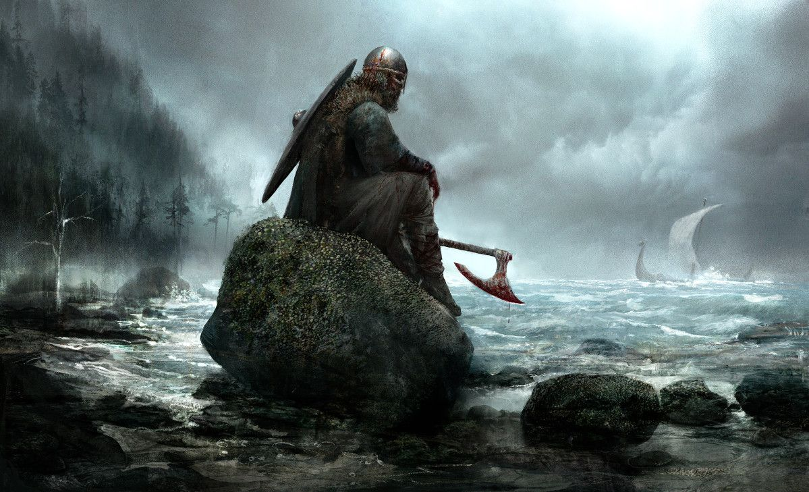

# The Harsh North
The Harsh North D20 campaign will follow a group comprised of mostly Norscan natives as they fight to survive the harsh Northern climate, struggle against its native monsters, raid their "weak" neighboring nations, and get tied up in power struggles between warring clans. This story will take place prior to the [Great War Against Chaos](https://warhammerfantasy.fandom.com/wiki/Great_War_Against_Chaos), which means the Norscans will have been mostly untouched by the influences of Chaos. Typical Norscan culture during this time period will resemble a highly aggressive Norse culture focusing on raiding, acquiring loot and slaves, and individual glory by proving one's worth in combat.

This will be an `asynchronous` campaign.
- This repository will serve as a place for rules, lore, and resources to be distributed.
- **The wiki section of this repository** may be used as a collaboration tool for tracking living information as the campaign progresses.
- Roleplaying will take place continuously via discord.
- Combat may be asynchronous depending on how well tooling works out.
- I plan on scheduling some in-person or online sessions for more important combat encounters.

## Roleplaying System

We'll be running this campaign using the **3rd edition Conan D20 system**. I chose this system primarily because it's very close to systems we all know (D&D 3.5 and Pathfinder), but it better suits the theme the story will touch on. I could have used the Warhammer Fantasy rules, but these are pretty foreign to us and I don't want to add that burden.

The 3rd edition Conan D20 system is extremely similar to D&D 3.5 with a few notable exceptions:
1. AC has been broken down into two active defensive options (*Dodge* and *Parry*), and armor instead provides *damage reduction*.
1. This is a very low magic system with a strong theme of corruption from its use.
1. Magic items and magical healing are rare.

### Rulebook
For simplicity, only the core rule book is allowed.
- [Conan D20 3.5](https://drive.google.com/file/d/0B36P1ltRqaAMMXNhMVQtM2NuSEU/view?usp=sharing&resourcekey=0-ftS9tc5byv7bF_sSPQL2ww)

## Campaign Setting
See the [campaign setting page](campaign-setting.md) for details about Norsca from Warhammer's Old World.

### Norsca

## Character Creation
See the [character creation page](character-creation.md) for more details.

## Discord Server
The Harsh North Discord server will be where gameplay takes place.

### Using Chat Channels

Chat channels have been categorized under **In Character** and **Out of Character**. Please pay attention to the channel's context when posting questions or in game content.

All **In Character** channels should contain only in character dialog or narration of actions. The exception being the use of *[threads](https://support.discord.com/hc/en-us/articles/4403205878423-Threads-FAQ)* for discussions about a particular in character post. **Use of threads in this manner is highly encouraged.**

### Rolling Dice in Discord
I added the [avrae discord bot](https://avrae.io/commands#dice) for rolling dice in discord (it does way more than rolling dice). We don't have to use it, but if you'd like to it's not too difficult. Just type `!roll 2d6+5` for a test.
