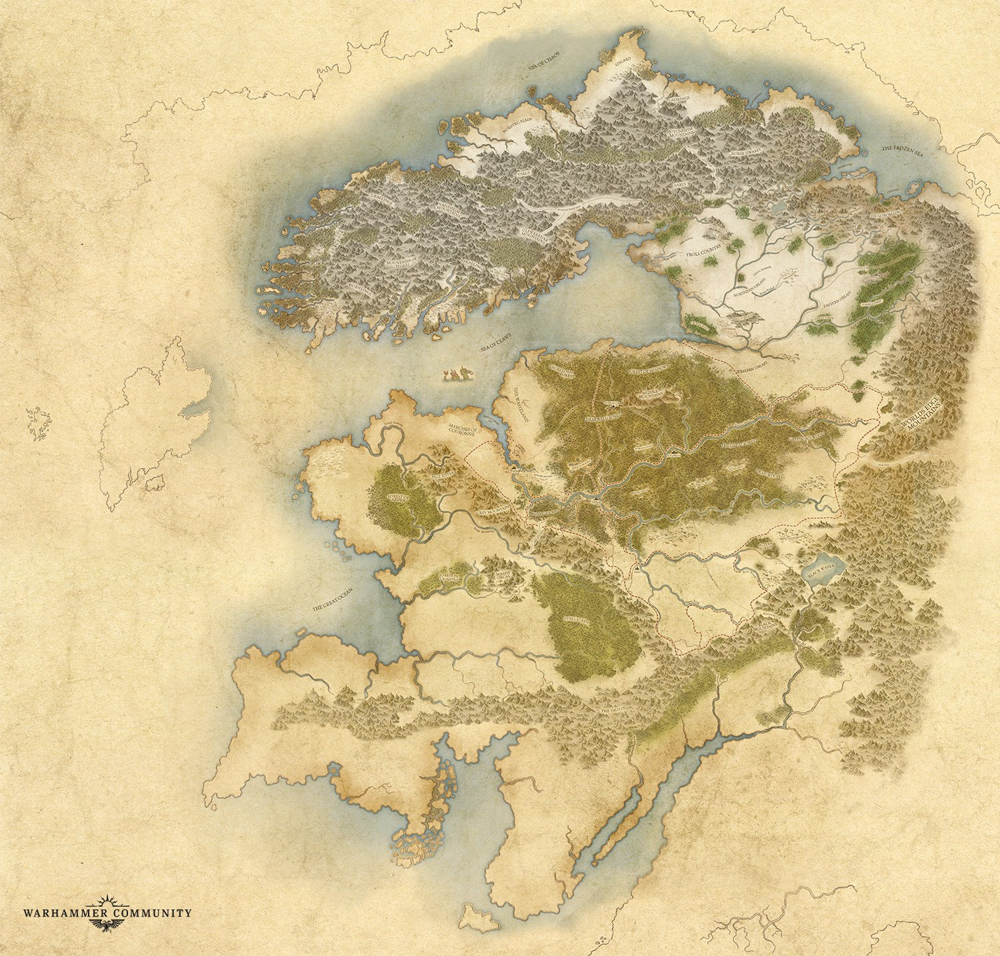

# The Harsh North
The Harsh North D20 campaign will follow a group comprised of mostly Norscan natives as they fight to survive the harsh Northern climate, struggle against its native monsters, raid their "weak" neighboring nations, and get tied up in power struggles between warring clans. This story will take place prior to the [Great War Against Chaos](https://warhammerfantasy.fandom.com/wiki/Great_War_Against_Chaos), which means the Norscans will have been mostly untouched by the influences of Chaos. Typical Norscan culture during this time period will resemble a highly aggressive Norse culture focusing on raiding, acquiring loot and slaves, and individual glory by proving one's worth in combat.

This will be an `asynchronous` campaign.
- Roleplaying will take place continuously via discord.
- Combat may be asynchronous depending on how well tooling works out
- I plan on scheduling some in-person or online sessions for more important combat encounters

## Roleplaying System

We'll be running this campaign using the **3rd edition Conan D20 system**. I chose this system primarily because it's very close to systems we all know (D&D 3.5 and Pathfinder), but it better suits the theme the story will touch on. I could have used the Warhammer Fantasy rules, but these are pretty foreign to us and I don't want to add that burden.

The 3rd edition Conan D20 system is extremely similar to D&D 3.5 with a few notable exceptions:
1. AC has been broken down into two active defensive options (*Dodge* and *Parry*), and armor instead provides *damage reduction*.
1. This is a very low magic system with a strong theme of corruption from its use.
1. Magic items and magical healing are rare.

### Rulebook
For simplicity, only the core rule book is allowed.
- [Conan D20 3.5](https://drive.google.com/file/d/0B36P1ltRqaAMMXNhMVQtM2NuSEU/view?usp=sharing&resourcekey=0-ftS9tc5byv7bF_sSPQL2ww)

#### Classes
The following character classes are permitted with minor revisions for flavor:
- Barbarian
- Ranger (`Borderer` in the rulebook)
- ~~Noble~~ (`Not permitted at this time`)
- Outrider (`Nomad` in the rulebook)
- Raider (`Pirate` in the rulebook)
- Scholar
- Soldier
- Rogue (`Thief` in the rulebook)

#### Races
Since we'll be playing in Norsca, the only playable race will be human. We'll keep it simple and just use the standard Human race from pathfinder. 

**Standard Racial Traits**
- **Ability Score Modifiers:** Human characters gain a +2 racial bonus to one ability score of their choice at creation to represent their varied nature.
- **Bonus Feat:** Humans select one extra feat at 1st level.
- **Skilled:** Humans gain an additional skill rank at first level and one additional rank whenever they gain a level.
- **Size:** Humans are Medium creatures and thus receive no bonuses or penalties due to their size.
- **Base Speed:** Humans have a base speed of 30 feet.
- **Languages:** Humans begin play speaking Common. Humans with high Intelligence scores can choose any languages they want (except secret languages, such as Druidic). See the Linguistics skill page for more information about these languages.

## Campaign Setting
Norsca from Warhammer's Old World.

- Feel free to use [this board for character inspiration](https://pin.it/2efSdAR)

## Discord Server

### Using Chat Channels
 
1. All chat channels are to be **in character only**, except in the following circumstances:
    - The channel is prefixed with `OOC-*`, designating it as an "Out of character" channel.
    - Discussions relating to a particular entry may be placed in a *[thread](https://support.discord.com/hc/en-us/articles/4403205878423-Threads-FAQ)* to avoid adding any noise to the in-character channel.
1. The Lore channel is meant to be used as a vehicle for the GM to disseminate information. 
    - To keep this information clean, please refrain from posting there unless you are using a thread.

