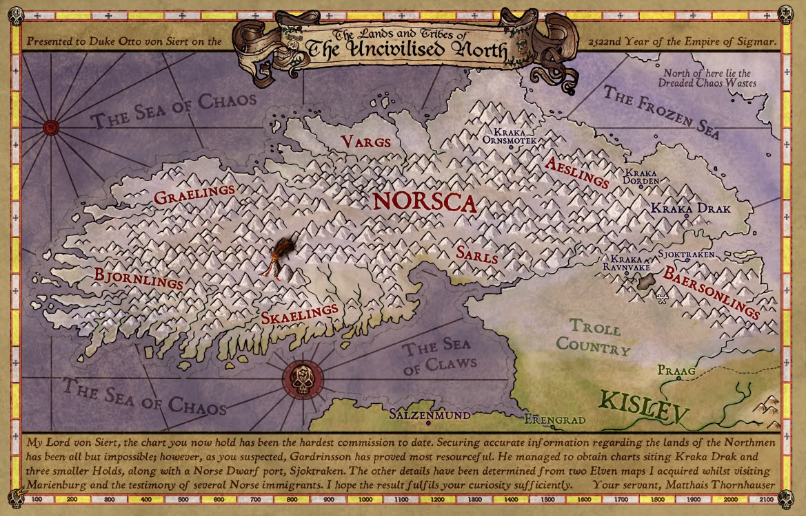
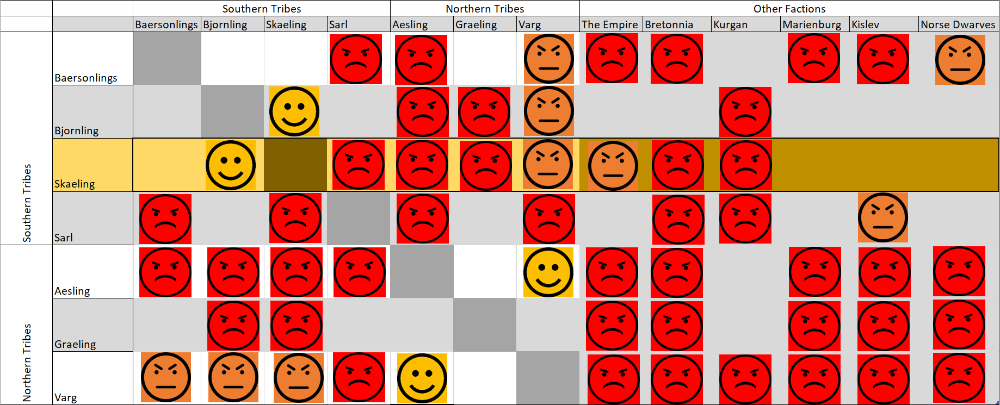

# Campaign Setting

- [Norsca Campaign Setting PDF](#norsca-campaign-setting-pdf)
- [Maps](#maps)
- [Factions](#factions)
- [Culture](#culture)
- [Religion](#religion)
- [Political Hierarchy](#political-hierarchy)
  - [Political Climate](#political-climate)
- [Moons: Mannslieb & Morrslieb](#moons-mannslieb--morrslieb)
- [Magic of the North](#magic-of-the-north)

## Norsca Campaign Setting PDF
Download and read the [Norsca Campaign Setting](https://drive.google.com/file/d/1-FAMZA2lqEmKI3TSAQgg8RCXqHaltvPZ/view?usp=sharing) for a great overview of Norsca.

**Recommended Material:**
- Chapter 1: Land
- Chapter 2: People of Norsca (p.38)
- Chapter 4: Society, (p.63)
    - Culture (p.69)
    - Death (p.70)
    - Insults (p.72)
    - Seasonal Events (p.80)
- Chapter 5: Clans (p.91 - 113)
- Chapter 6: Religion (p.135)
    - Olric (p.141, 177)
    - Ancestor Worship (p.142)

## Maps

- [Old World Overview](resources/maps/old-world.webp)
- [Norscan Geographic Map](resources/maps/old-world-norsca.png)
- [Norscan Detail Map](resources/maps/norsca-detail-map-v3.jpg)
- [Norscan Detail Ownership Map](resources/maps/norsca-detail-map-v3-ownership.jpg)
- [Norsca Factions](resources/maps/map-norsca-factions.jpg)
- [The Empire](resources/maps/old-world-empire.jpg)
- [Other Maps](resources/maps)

## Factions
See the [factions page](factions.md) for details on relevant factions surrounding Norsca.

## Culture
See the [culture page](culture.md) for details on differences between the cultures among the clans, what they share, and Norscan social hierarchy.

## Religion
See the [religion page](religion.md) for details on the faith and the gods in Norsca.

## Political Hierarchy
1. **Norsca** - The region where all Norscan people live; not a single nation.
1. **Clans** - Collections of minor clans or tribes lead by a single chief or a king.
1. **Minor Clan / Tribes** - Groups of communities and peoples lead by a single strong war leader.

### Political Climate

In the Old World, cultures clash; Kingdoms and Empires struggle with another for territory and dominance. However, it is important to remember that within otherwise friendly kingdoms, or even within a single kingdom itself, there are often feuds and alliances; some petty and fleeting, and others truly blood feuds lasting generations. These machinations are too many to document in their entirety, but here are a few of the major attitudes between the Norscan Factions and their immediate neighbors.

## Moons: Mannslieb & Morrslieb
The Warhammer world is orbited by two moons:
- **Mannslieb:** white, large, present from beginning of time
- **Morrslieb:** green, small, new and ever changing

The larger of the two moons is called Mannslieb and it acts and appears as any normal moon, having a cycle of 25 days from full to full, and orbits the planet upon a predictable orbit. Mannslieb means "Beloved of Manann" in Reikspiel and this moon is held sacred to Manann, god of the Sea.

Morrslieb, the smaller moon, is all but predictable; appearing sometimes closer and other times farther away than its partner. Its position has major influence upon the Winds of Magic. The name Morrslieb (meaning "Beloved of Morr") is in honor of Morr, the god of the dead.

A common legend tells that daemons once preyed upon the people of the world from a gateway in the sky, until Morr inflicted a great death upon them. Afterwards he fashioned the second moon from the wreckage of the daemons, so that mortals would never forget how he had saved them.

The second legend, which is mainly held by followers of Chaos, is that upon the collapse of the polar warp gates, a great block of Warpstone was hurled high into the sky, where it now circles the planet endlessly, spreading Chaos over the lands which it passes.

From time to time, meteors of Warpstone coming from Morrslieb fall upon the planet.

There are two nights in the year in which both moons are full at the same time. The first is called Hexensnacht ("Witching Night") and the other one Geheimnisnacht ("Night of Mystery"). To most, these are greatly feared and ill-omened nights of the year, and even the most cynical sceptic will avoid the eerie light cast by the full moons. On the other hand, gatherings and ritual sacrifices are held by the worshippers of Chaos on these nights.

## Magic of the North
Norscan magic is called Murkr. It is a wild untamed magic seeped in ritual. Unlike the magic of the southern provinces, Murkr magic requires specific ingredients and ritual to perform. Even the most basic of Murkr magic requires some form of substance to function. It is steeped in ritualism and often requires blood sacrifice. Yet when it does function, it is potent and powerful. Due to the close vicinity of the northern wastes, Norsca is seeped in powerful winds of magic, and those who know how to channel that magic can unleash deadly untold destruction. A good comparison between the different schools of magic can be made using this example: If a human wizard of the Empire wished to cast a spell, he need only perform the words needed to be said in its arcane tongue, and thus cast the spell.

However, if a Norscan shaman who practiced Murkr wished to cast a similar spell, he would first need the ingredients to do so, and second, perform it in a ritualistic manner. As such, Murkr does not make good combat magic as it requires preparation and considerable time to perform. But the Norscan’s do not use Murkr in an offensive manner. They use it to make their lives easier or when tradition calls for its use such during times of great sacrifices and celebration. Murkr excels however when used in a defensive manner.