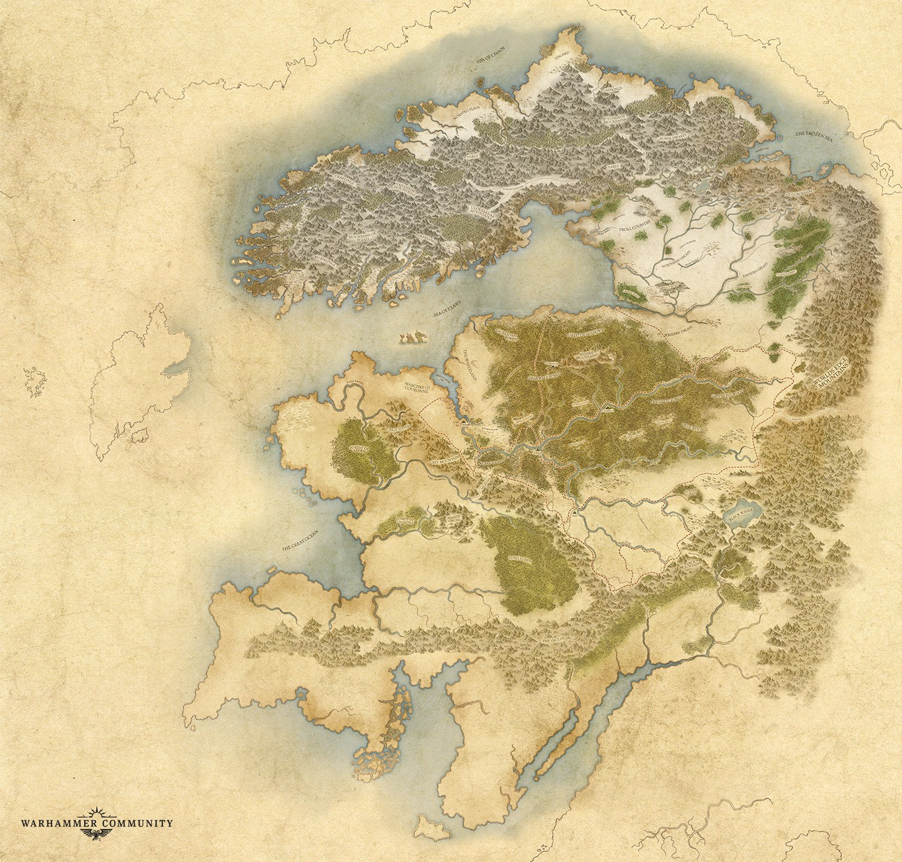

# Campaign Setting

## Maps

### Old World

### Norsca

### Other Maps
- [Maps](resources/maps)

## Political Hierarchy
1. **Norsca** - The region where all Norscan people live; not a single nation.
1. **Kingdoms** - Collections of clans lead by a single king.
1. **Clan** - Groups of communities and peoples lead by a single strong war leader.

### Political Climate

See the [factions page](factions.md) for details on relevant factions surrounding Norsca.

## Social Hierarchy
1. **High King** - A king with power over many kingdoms, typically via vassalage.
1. **King** - The leader of a particular kingdom or tribe.
1. **Seers** - Spiritual leaders, shamen, magi, magisters.
1. **Jarl/Chief** - Lords or Nobility; a chieftain. 
1. **Named Men** - Noted or famed warriors.
1. **Carl** - Freemen and land owners; normal citizens.
1. **Thrall** - Slaves of all kinds; second wives, forced laborers, servants, levy soldiers.

See the [reputation section on the character creation page](character-creation.md#reputation) for more clarity on the disparity in reputation between the social classes.

### Named Men
At the top of the non-ruling social scale are the Named Men, those warriors who have earned great respect in battle. Most earn badass names, like Shama Heartless, the Bloody-Nine, or Tul Duru Thunderhead. Sometimes however, they gets pegged with an unfortunate nicknames, such as Forley the Weakest or Caul Shivers, who fell in a freezing river during a raid.

### Women
Though Norse society is patriarchal, women have a stronger place in these lands than many might suspect. A woman may own property and can become a Jarl if her husband dies and has no male offspring. It is up to the woman to decide whom she weds and if she divorces. While women are generally expected to stay behind during raids and wars, it falls to them to protect the home. Most are competent, if not skilled warriors in their own right. It is not unheard of to have a shield maiden join the shield wall alongside her clansmen. If a woman is skilled and favored enough, she can be given the right to join a raid.

## Military
Norscan armies are grouped about the chieftains of the clans, strong war leaders in their own right. Most of the soldiers are Thralls; peasants young and old pressed into service and lightly armed. In the past these were badly trained, but recent wars have been raging for so long that many have become hard fighters. Each chieftain keeps household warriors called Carls, well-armed, armoured, skilled, and disciplined. Lastly there are the Named Men, who might lead groups of Carls on the field, or act as scouts or raiders deep in the enemy’s terrain.

### Duels in the Circle
Duel in the Circle, a one-on-one fight to the death between champions, used to resolve disputes without war. The form of a Duel is highly ritualised. The men fight in a circle six good strides across, with the grass shaved to the roots. Carls from both parties form a shield-wall around the edge, allowing only one man to leave alive. Before the bout, a judge introduces the champions, confirms the stakes, and chooses weapons by the spin of a shield. Thus each man can bring any weapon, but might have to fight with his opponents. Any form of cheating in a Duel is considered a terrible crime. The victor can choose to spare the life of his opponent, which means the man owes a debt of loyalty for the rest of his life.
